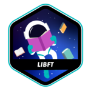

# Common_Core

42 is a school with a *different* approach. The school have campuses all around the world and believes in the peer-to-peer learning. This means that we have *no teachers* and we *learn* at the same time that we *teach*.
To enter at 42 school, we need to pass to a selective process called Piscine, that is a intensive training with the duration of 1 month.
At 42 we are rigorous at evaluations, this makes our learning process much more powerful and prepare us more effectivelly for job market.

Below I present some projects that I've been worked on so far on 42 Porto Common Core course. We use mostly C language.
|[Libft](https://github.com/amauricoder/42_libft)|[Ft_Prinft](https://github.com/amauricoder/42_ft_printf)|[Get_Next_Line](https://github.com/amauricoder/42_get_next_line)|
| :-----------------------------------: | :-------------------------------------------: | :---------------------------------------------------: |
|  |  |  |
|  |  |  |

|[Push_Swap](https://github.com/amauricoder/42_Push_Swap)|[So_Long](https://github.com/amauricoder/42_So_Long)|[Pipex](https://github.com/amauricoder/42_Pipex)|
| :-------------------------------------------: | :-------------------------------------------: | :---------------------------------------------------: |
|  |      |                  |
|  |  |  |

|[Philosophers](https://github.com/amauricoder/42_Philosophers)|
| :-------------------------------------------: |
|  |
|  |

If you are interested in know more about 42 schools and the learning method:

  
[Find me as aconceic on 42 intra!](https://profile.intra.42.fr/users/aconceic)

